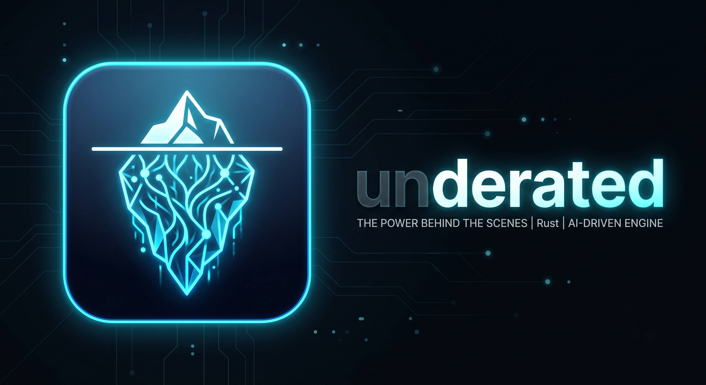

<p align="center">
  
</p>

# underrated

**An ad-free browser where humans and AI agents work *side by side, on the same screen*.**
Written from scratch in Rust — *by AI agents*, *for the OpenClaw era*.

> ⚠️ **Very early. But fast.**
> `underrated` is a rendering engine built from zero that already runs the **full pipeline** —
> HTML parsing → DOM → CSS → layout → paint → on-screen. It fetches real pages over the network
> and draws them into a window. **It is not a daily-driver browser yet.**
> We are right at the doorstep of the first north star — "**display the real Google and have search
> actually work**" (2026-06).
> <!-- ✅ When Google search works end-to-end, change this line to "achieved". -->

## Why build this

Today's "AI browsers" (Comet / Atlas / Dia …) are Chromium forks designed so the **agent acts *for*
you and the human steps aside**. `underrated` makes the opposite bet.

- 🤝 **Co-presence, not delegation.** Humans and LLMs operate on the *same page* at the *same time*.
  The agent is a collaborator inside the tab, not your replacement.
- 🚫 **Ad-free by construction.** Ads, trackers, and consent modals are **never built**, not blocked
  after the fact — a page representation that is light and accurate for both humans and LLMs, at the
  core level.
- 🦞 **Agent-native.** Humans, agents, and automation share the *same NodeId and the same input path*
  by design — aiming to be a first-class target for external agents like Claude / Gemini / OpenClaw.
- 🛠️ **From scratch, in Rust.** No inherited Chromium debt. An engine designed for the agent era from
  the start, not retrofitted into it.

> Why "underrated" — because ad-free × human-AI co-presence is, we think, the most *underrated*
> direction in the agentic-browser race.

## Design principles

Invariants enforced in the code from day one.

- **Single source of truth.** Everything derives from the DOM (+ style + layout). The Markdown/JSON
  projections for LLMs are derived views, not a *second* truth.
- **Single address space.** Humans and agents point at the same element via the same `NodeId`.
- **Single action path.** An agent's actions are semantic events that travel the *same* input path as
  a human click — which is why "human-AI co-presence" needs no extra machinery.
- **Deterministic core.** Non-determinism (IO, input, clock, randomness) is pushed to the edges — so a
  session can be recorded and *replayed identically*: the basis for debugging, auditing, and trust.

## Where it is, and where it's going

| Stage | Status |
|-------|--------|
| Network fetch (HTTP/HTTPS, cookies/POST) | ✅ works |
| HTML → DOM | ✅ end-to-end |
| CSS (parsing, selectors, cascade, @media) | ✅ core + expanding |
| Layout (block / inline wrapping / flexbox) | 🟡 expanding |
| Paint & display (glyphs / images / scroll) | 🟡 maturing |
| **North star: display real Google + working search** | 🔜 nearly there |
| co-presence / ad-free / agent layer | 🌅 after the core stabilizes (the goal) |

> The engine's *correctness* is tightened incrementally against oracles such as WPT.

## How it's being built

`underrated` is developed by **directing parallel LLM agents** — a human as director, multiple AIs as
workers. It moves fast enough that the major engine stages stand up in a day, and **we show the
process: the wins, the dead ends, and the rework.**
<!-- TODO: link the dev log / newsletter -->

## Build (for developers)

```bash
git clone --recurse-submodules https://github.com/wicca1984/underrated
cd underrated
cargo run
```

- Requires: **Rust 1.85+ (edition 2024)** / `git` (the test suite uses a submodule, hence `--recurse-submodules`).
- Discipline: **no `unsafe`**, **no `unwrap`/`expect` in production code**, **all CI gates green**
  (`cargo test`, `cargo clippy --all-targets -- -D warnings`, `cargo fmt --all --check`).

Runnable example — fetch a real page through the engine and report what it renders:

```bash
cargo run --example render_url -- https://example.com/ out.ppm
# prints DOM/raster stats and writes a PPM screenshot
```

## Getting involved

It's very early, so the best way to help right now is to **Watch / Star** and follow the process.
A contribution policy will come later.

- 🐦 X: <!-- TODO -->
- 📰 Dev log (newsletter): <!-- TODO -->
- 💛 Sponsor: [github.com/sponsors/wicca1984](https://github.com/sponsors/wicca1984)

## License

[Apache-2.0](LICENSE)
